# Architecture Station Blanche

## Diagramme complet — tous modes de déploiement

```mermaid
graph TB
    subgraph UTILISATEURS["UTILISATEURS"]
        U1[Opérateur Station]
        U2[Admin SI]
        U3[Admin Serveur Central]
    end

    subgraph STATION_AUTONOME["MODE 1 — STATION AUTONOME (standalone)"]
        direction TB

        subgraph FE_STATION["Frontend React :3000"]
            APP[App.js — Router]
            USB_SCAN[USBScanner.js]
            USB_TRANSFER[USBTransferGuided.js]
            PC_SCAN[RemotePCScanner.js]
            ADMIN_UI[AdminPanel.js]
            KEYBOARD[VirtualKeyboard]
        end

        subgraph BE_STATION["Backend Express :8000"]
            SERVER[server.js — 30+ endpoints]
            ADMIN_JS[admin.js — Auth bcrypt]
            CERT_MGR[certificate-manager.js — RSA-2048]
            EDR_ENT[entropy-analyzer.js — Shannon]
            EDR_RANSOM[ransomware-detector.js — 50+ patterns]
            ROUTES_CERT[routes/certification.js]
        end

        subgraph SCANNERS["Scanners Python"]
            USB_PY[usb_scanner.py]
            WS_PY[workstation_scanner.py]
            CLAMAV[(ClamAV Daemon)]
        end

        subgraph DATA_LOCAL["Stockage Local JSON"]
            SCANS_JSON[scans.json]
            TRANSFERS_JSON[transfers.json]
            CERTS_LOCAL[certificates/]
            KEYPAIR[station-keypair.json]
        end

        FE_STATION -->|HTTP REST| BE_STATION
        BE_STATION -->|spawn subprocess| SCANNERS
        SCANNERS -->|clamd socket| CLAMAV
        BE_STATION -->|lecture/écriture| DATA_LOCAL
        CERT_MGR -->|RSA sign| KEYPAIR
    end

    subgraph USB_DEVICES["PERIPHERIQUES USB"]
        USB_SRC[USB Source]
        USB_DEST[USB Destination]
        USB_SRC -->|montage read-only| SCANNERS
        USB_SRC -.->|.cyberbox-cert/cert.json| CERT_MGR
        USB_DEST -->|rsync transfert| USB_SRC
    end

    U1 -->|interface tactile| FE_STATION

    subgraph STATION_CONNECTEE["MODE 2 — STATION CONNECTÉE AU SERVEUR"]
        direction TB

        subgraph SYNC_SERVICE["Services de Sync"]
            MASTER_SYNC[master-sync.js]
            CONFIG_SRV[config/server.js]
            SERV_CFG_JSON[data/server-config.json]
        end

        MASTER_SYNC -->|heartbeat /1min| SYNC_SERVICE
        MASTER_SYNC -->|sync certs+règles /5min| SYNC_SERVICE
        MASTER_SYNC -->|report scan immédiat| SYNC_SERVICE
        CONFIG_SRV --> SERV_CFG_JSON
    end

    subgraph SERVEUR_CENTRAL["MODE 3 — SERVEUR CENTRAL (Enterprise)"]
        direction TB

        subgraph FE_SERVER["Dashboard React :3000"]
            LOGIN[LoginPage.js]
            DASHBOARD[DashboardPage.js]
            STATIONS_PAGE[StationsPage.js]
            CERTS_PAGE[CertificatesPage.js]
            LOGS_PAGE[LogsPage.js]
            ALERTS_PAGE[AlertsPage.js]
            SETTINGS_PAGE[SettingsPage.js]
        end

        subgraph BE_SERVER["Backend Express :3100"]
            SRV_SERVER[server.js — API centrale]
            SRV_AUTH[middleware/auth.js]
            RT_STATIONS[routes/stations.js]
            RT_CERTS[routes/certificates.js]
            RT_LOGS[routes/logs.js]
            RT_ALERTS[routes/alerts.js]
            RT_EDR[routes/edr.js]
            RT_AD[routes/active-directory.js]
            RT_UPDATES[routes/updates.js]
            RT_APIKEYS[routes/api-keys.js]
            WS_SERVER[Socket.io — WebSocket]
        end

        subgraph DB_LAYER["Base de Données"]
            PG[(PostgreSQL)]
            REDIS[(Redis — Sessions/Cache)]
            SCHEMA[schema.sql — 11 tables]
        end

        subgraph AD_INTEGRATION["Active Directory (optionnel)"]
            LDAP[LDAP / Kerberos]
        end

        FE_SERVER -->|HTTP REST| BE_SERVER
        BE_SERVER <-->|pool connexions| PG
        BE_SERVER <-->|sessions| REDIS
        WS_SERVER -->|temps réel| FE_SERVER
        RT_AD <-->|ldap://| LDAP
    end

    subgraph INFRA["INFRASTRUCTURE SERVEUR"]
        NGINX[Nginx — Reverse Proxy]
        SYSTEMD[systemd — Services Linux]
        UFW[UFW — Firewall]
    end

    subgraph WSEVENTS["WebSocket Events (Socket.io)"]
        direction LR
        EV1[station:online/offline]
        EV2[scan:started/completed]
        EV3[threat:detected]
        EV4[certificate:created/revoked]
        EV5[alert:new]
        EV6[update:progress]
    end

    U2 -->|interface admin| ADMIN_UI
    U3 -->|dashboard web| FE_SERVER

    SYNC_SERVICE -->|X-API-Key| BE_SERVER
    BE_SERVER -->|broadcast| WSEVENTS
    WSEVENTS --> FE_SERVER

    NGINX --> FE_SERVER
    NGINX --> BE_SERVER
    SYSTEMD --> BE_SERVER
    SYSTEMD --> FE_SERVER

    subgraph FLUX_CERT["FLUX DE CERTIFICATION USB"]
        direction LR
        FC1[Scan ClamAV clean] --> FC2[Signer RSA-2048]
        FC2 --> FC3[Écrire .cyberbox-cert sur USB]
        FC3 --> FC4{Serveur actif?}
        FC4 -->|oui| FC5[POST /api/v1/certificates/publish]
        FC4 -->|non| FC6[Stockage local uniquement]
        FC5 --> FC7[INSERT PostgreSQL]
        FC7 --> FC8[Broadcast autres stations via sync]
    end

    subgraph FLUX_SCAN["WORKFLOW SCAN USB"]
        direction LR
        FS1[Détection USB sysfs/udevadm] --> FS2[Montage read-only]
        FS2 --> FS3{Certificat valide\net non expiré?}
        FS3 -->|oui| FS4[Skip scan — Transfert direct]
        FS3 -->|non| FS5[ClamAV + EDR + Entropy]
        FS5 --> FS6[Score risque 0-100]
        FS6 --> FS7[Résultat + Log]
    end

    style STATION_AUTONOME fill:#1e3a5f,stroke:#4a9eff,color:#fff
    style STATION_CONNECTEE fill:#1e3a5f,stroke:#4a9eff,color:#fff
    style SERVEUR_CENTRAL fill:#3a1e5f,stroke:#9a4aff,color:#fff
    style UTILISATEURS fill:#1e5f3a,stroke:#4aff9a,color:#fff
    style USB_DEVICES fill:#5f3a1e,stroke:#ff9a4a,color:#fff
    style INFRA fill:#3a3a1e,stroke:#ffff4a,color:#fff
    style FLUX_CERT fill:#1e4f4f,stroke:#4affff,color:#fff
    style FLUX_SCAN fill:#1e4f4f,stroke:#4affff,color:#fff
```

## Modes de déploiement

| Mode | Description | Stack | Cas d'usage |
|------|-------------|-------|-------------|
| **Mode 1 — Autonome** | Station indépendante, aucun serveur | React + Express + ClamAV | PME, écoles |
| **Mode 2 — Connectée** | Station synchronisée avec serveur central | + master-sync.js | Multi-sites |
| **Mode 3 — Serveur Central** | Dashboard multi-stations + BD centralisée | + PostgreSQL + Redis + Socket.io | Hôpitaux, collectivités |

## Ports

| Service | Port | Protocole |
|---------|------|-----------|
| Frontend Station | 3000 | HTTP |
| Backend Station | 8000 | HTTP REST |
| Backend Serveur Central | 3100 | HTTPS REST + WS |
| PostgreSQL | 5432 | TCP |
| Redis | 6379 | TCP |
